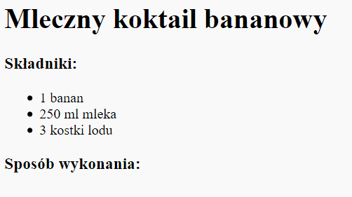
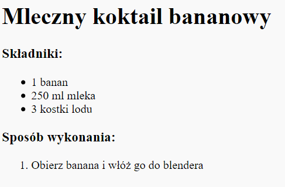

## Metoda

Następnie wyjaśnijmy jak ugotować twój przepis.

+ Wykorzystasz kolejną listę, aby opisać swoją metodę, ale tym razem użyjesz **listy uporządkowanej** za pomocą znacznika `<ol>`.

Lista uporządkowana to numerowana lista, której powinnaś użyć jeżeli kolejność kroków jest istotna.

Dodaj ten kod pod twoją listą składników, upewnij się, że jest on wciąż wewnątrz twojego znacznika `<body>`:

    <h3>Metoda:</h3>
    
    <ol>
    
    </ol>
    

+ Teraz musisz tylko dodać elementy do twojej nowej uporządkowanej listy:

    <li>Peel the banana and add to a blender</li>
    

Notice that the list items are automatically numbered!