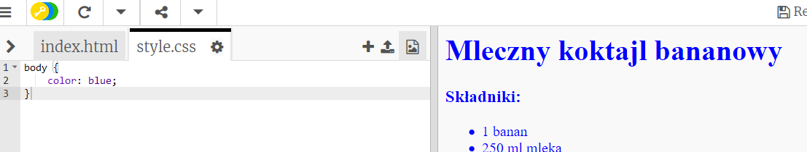
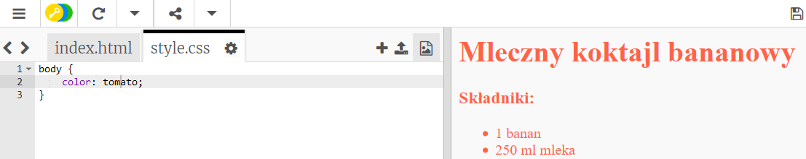
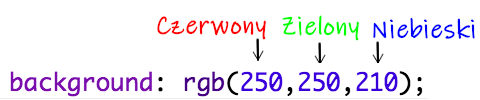
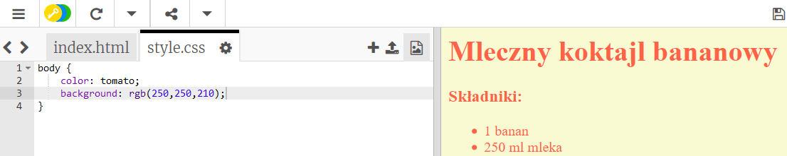
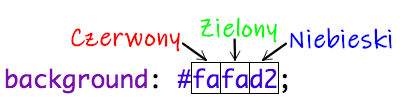
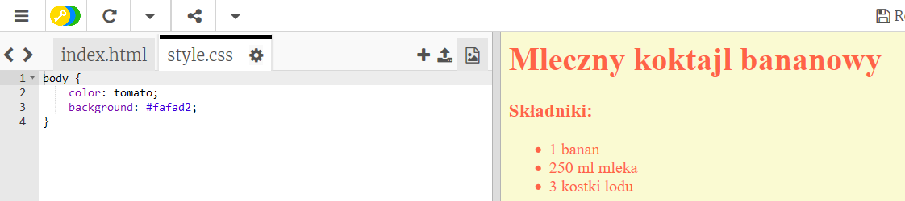

## Kolory!

Dodajmy trochę barw do twojej strony internetowej z przepisem.

+ Już dowiedziałeś się jak dodawać kolorowy tekst do strony internetowej. Dodaj ten kod wewnątrz twojego pliku `style.css`, aby sprawić, że cały tekst na stronie stanie się niebieski:

    body {
        color: blue;
    }
    

+ Twoja przeglądarka zna kolory takie jak `blue` (niebieski), `yellow` (żółty), a nawet `lightgreen` (jasnozielony), ale czy wiedziałaś, że twoja przeglądarka zna **nazwy** ponad 140 różnych barw?

Tutaj znajdziesz listę ze wszystkimi nazwami kolorów, których możesz użyć: [jumpto.cc/colours](http://jumpto.cc/colours) (np. `tomato`, `firebrick`, `peachpuff`).

Zmień kolor tekstu z `blue` na `tomato` (pomidor).

+ Twoja przeglądarka zna nazwy ponad 140 kolorów, ale zna także ponad 16 milionów **wartości kolorów**!

Żeby powiedzieć przeglądarce, który kolor ma wyświetlić, musisz jej wskazać ile ma użyć czerwonego, zielonego i niebieskiego.

Ilości czerwonego, zielonego i niebieskiego są zapisywane jako liczba pomiędzy `0`, a `255`.

Dodaj ten kod CSS dla treści strony internetowej, aby wyświetlić jasnożółte tło:

    background: rgb(250,250,210);
    

+ If you prefer, you can tell the browser which colour to display by using a hexadecimal code (or **hex code**). This works in a similar way to the `rgb()` code above, except that hex codes always start with a `#`, and use hexadecimal ‘numbers’ between `00` and `ff` for the amount of red, green and blue.

Replace the `rgb()` code in your CSS with this hex code:

    background: #fafad2;
    

You should see the same light yellow as before!