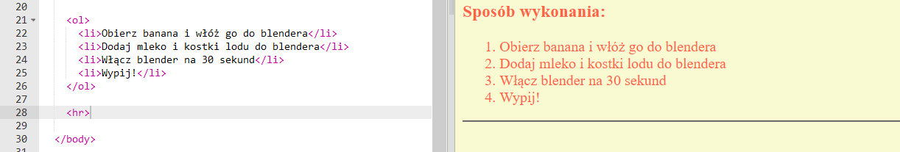
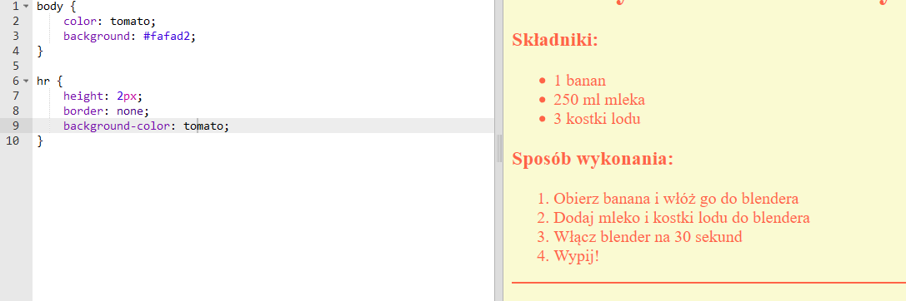
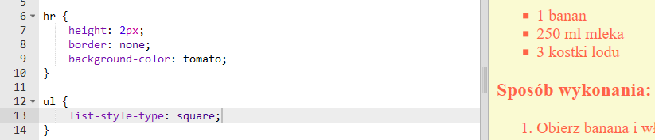

## Ostatnie pociągnięcia

Dodajmy nieco więcej HTML i CSS, aby ulepszyć twoją stronę internetową.

+ Możesz dodać poziomą linię na końcu twojego przepisu za pomocą znacznika `<hr>`.



Zauważ, że ten znacznik nie ma znacznika zamykającego, tak samo jak znacznik ``.

+ Linia, którą dodałaś nie pasuje stylem do reszty twojej strony. Naprawmy to dodając trochę kodu CSS:
```
    hr {
        height: 2px;
        border: none;
        background-color: tomato;
    }
```    



+ Za pomocą tego kodu CSS możesz nawet zmienić wygląd twoich punktorów:
```
    ul {
        list-style-type: square;
    }
```    

