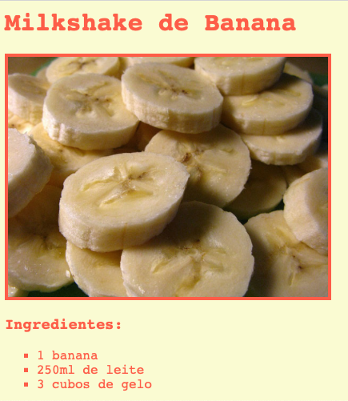

## Introdução

Neste projeto, você aprenderá a criar uma página da Web para suas receitas favoritas.

### Informação adicional para líderes de clubes

Se você precisar imprimir este projeto, use a [Versão para Impressão](https://projects.raspberrypi.org/pt-BR/projects/recipe/print).

--- collapse ---
---
title: Notas para o líder do Clube
---

## Introdução:

Neste projeto, as crianças aprenderão sobre listas HTML e cores CSS. Elas criarão suas próprias receitas, adicionando listas de ingredientes e modos de preparo.

## Recursos Online

Recomendamos usar [trinket](https://trinket.io/) para escrever HTML & CSS online.

Crianças também podem usar este trinket em branco [(jumpto.cc/html-blank)](http://jumpto.cc/html-blank) para escrever seu próprio HTML & CSS ou, como alternativa, elas podem usar este modelo de trinket [(jumpto.cc/html-template)](http://jumpto.cc/html-template).

Há também um Trinket contendo um exemplo de solução para os desafios:

+ [‘Recipe’ Finished -- trinket.io/html/c0fd9b40cd](https://trinket.io/html/1fd2076622)

## Recursos Offline

Este projeto pode ser [concluído offline](https://www.codeclubprojects.org/en-GB/resources/webdev-working-offline/), se você preferir. Você pode acessar os recursos disponíveis clicando no link 'Materiais do Projeto'. Este link contém uma seção "Recursos do Projeto", que inclui recursos que as crianças precisarão para concluir esse projeto off-line. Certifique-se de que cada criança tenha acesso a uma cópia desses recursos. Esta seção inclui os seguintes arquivos:

+ template/index.html
+ template/style.css

Você também pode encontrar uma versão completa dos desafios deste projeto na seção "Recursos para Voluntários", que contém:

+ recipe-finished/index.html
+ recipe-finished/style.css
+ recipe-finished/banana.jpg

(Todos os recursos acima também podem ser baixados como arquivos de projeto e de voluntário no formato `.zip`.)

## Objetivos de aprendizado

+ Escrevendo HTML:
    
    + `<ul>`, `<ol>` e `<li>` são lista de tags html;
    + `
` tag;
    + Consolidando o uso de tags aninhadas.

+ Escrevendo CSS:
    
    + Cores (nomes & códigos hexadecimais).

Este projeto abrange elementos das seguintes vertentes do [Currículo de Criação Digital Raspberry Pi](http://rpf.io/curriculum):

+ [Design de ativos básicos em 2D e 3D](https://www.raspberrypi.org/curriculum/design/creator).

## Desafios

"Mais ingredientes" - adicionar mais itens a uma lista não ordenada; "Mais etapas" - adicionar mais itens a uma lista ordenada; "Mais cores" - adicionar nomes de cores, valores de rgb e códigos hexadecimais; "Comentários" - adicionar outra lista não ordenada; "Mais estilo" - adicionar imagens e fontes.

## Complete este projeto offline

Se as crianças concluírem esse projeto offline, elas precisarão salvar as imagens que pretendem usar na mesma pasta do arquivo Template.html.

Elas podem então adicionar o nome do arquivo em suas tags ``:

    
    

--- /collapse ---

--- collapse ---
---
title: Materiais do projeto
---

## Recursos do projeto

+ [Arquivo .zip contendo todos os recursos do projeto](resources/recipe-project-resources.zip)
+ [Template Online Trinket](http://jumpto.cc/trinket-template)
+ [Trinket online em branco](http://jumpto.cc/trinket-blank)
+ [template/index.html](resources/template-index.html)
+ [template/style.css](resources/template-style.css)

## Recursos para o Líder do Clube

+ [Arquivo .zip contendo todos os recursos concluídos do projeto](resources/recipe-volunteer-resources.zip)
+ [Projeto Trinket concluído online](https://trinket.io/html/1fd2076622)
+ [recipe-finished/index.html](resources/recipe-finished-index.html)
+ [recipe-finished/style.css](resources/recipe-finished-style.css)
+ [recipe-finished/banana.png](resources/recipe-finished-banana.png)

--- /collapse ---