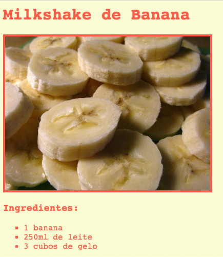

--- challenge ---

## Desafio: Mais estilos

Você consegue adicionar uma imagem à sua página da web? Ou mudar a fonte? Veja como sua página Web poderia ser:

Aqui vai alguns códigos que ajudarão você:

    font-family: Arial / Comic Sans MS / Courier / Impact / Tahoma;
    font-size: 12pt;
    font-weight: bold;
    
    
    

--- /challenge ---

**Tradução Contribuída pela Comunidade**

Este projeto foi traduzido por **Valdecir Neumann** e revisado por **Artur Licks**.

Nossos incríveis voluntários de tradução nos ajudam a dar as crianças em todo o mundo a oportunidade de aprender a programar. Você pode nos ajudar a alcançar mais crianças traduzindo nossos projetos - leia mais em [rpf.io/translators](https://rpf.io/translators).