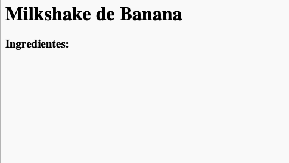

## Ingredientes

Vamos listar os ingredientes que são necessários para sua receita.

+ Abra este modelo trinket: [jumpto.cc/html-template](http://jumpto.cc/html-template){:target="_blank"}.
    
    O projeto deve ficar parecido com isso:
    
    

+ Para sua lista de ingredientes, você usará uma **lista não ordenada**, usando a tag `<ul>`. Vá para a linha 8 do modelo e adicione este HTML, substituindo o texto no título `<h1>` pelo nome da sua própria receita:

    <h1>Milkshake de Banana </h1>
    
    <h3>Ingredientes:</h3>
    
    <ul>
    
    </ul>
    

+ Veja sua página de internet, e você deverá visualizar seus dois cabeçalhos.

Você ainda não verá sua lista, porque ainda não adicionou nenhum item na lista!

+ O próximo passo é adicionar itens a sua lista, usando a tag `<li>`. Adicione o seguinte código dentro da sua tag `<ul>`:

    <li>1 banana</li>
    

Como sua lista é sem ordenação, não há nenhum número nas linhas de itens, apenas marcadores em forma de bolinha.