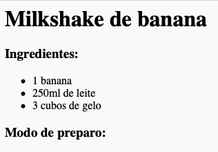
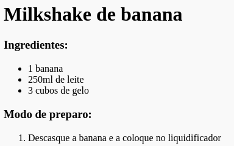

## Modo de preparo

Em seguida, vamos explicar como fazer a sua receita.

+ Você usará outra lista para escrever seu modo de preparo, mas desta vez, usará uma **lista ordenada**, usando a tag `<ol>` (ol vem do inglês "ordered list", que significa lista com ordenação).

Uma lista ordenada é uma lista numerada, que você deve usar quando a ordem das etapas é importante.

Adicione este código abaixo da sua lista de ingredientes, certificando-se de que seu código esteja dentro da sua tag `<body>`:

    <h3>Modo de preparo:</h3>
    
    <ol>
    
    </ol>
    

+ Agora você vai adicionar novos itens na sua nova lista ordenada:

    <li>Descasque a banana e adicione ao liquidificador</li>
    

Observe que os itens da lista são automaticamente numerados!