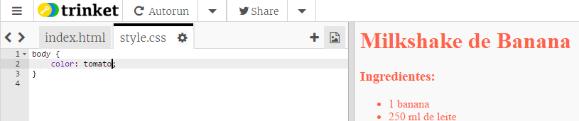

## Cores!

Vamos adicionar algumas cores à página de internet de sua receita.

+ Você já aprendeu a adicionar texto colorido a uma página de internet. Adicione este código dentro do seu arquivo `style.css`, para fazer com que o texto no corpo (body) da sua página fique azul:

    body {
        color: blue;
    }
    

+ Seu navegador conhece cores como `blue` (azul), `yellow` (amarelo) e até mesmo `lightgreen` (verde claro), mas você sabia que seu navegador realmente conhece os **nomes** de mais de 140 cores diferentes, no idioma inglês?

Há uma lista de todos os nomes de cores que você pode usar: [jumpto.cc/colours](http://jumpto.cc/colours), que inclui nomes de cores como `tomato` (Tom-mate), `firebrick` (tijolo fumegante) e `peachpuff` (sopro de pêssego).

Altere a cor do texto de `blue` (azul) para `tomato` (Tom-mate).

+ Seu navegador conhece os nomes de 140 cores, no idioma inglês, mas na verdade conhece os **valores de cor (RGB)** com mais de 16 milhões de cores!

Para informar ao navegador qual cor exibir, você só precisa informar o quanto Red (vermelho), Green (verde) e Blue (azul) deve usar.

As quantidades de Red (vermelho), Green (verde) e Blue (azul) são escritas como um número entre `0` e `255`, para cada um dele.

Adicione este código ao CSS para o corpo da página de internet, para exibir um plano de fundo amarelo claro:

    background: rgb(250,250,210);
    

+ Se preferir, você pode informar ao navegador qual cor exibir usando um código hexadecimal (ou **hex code**). Isso funciona de maneira semelhante ao código `rgb()` acima, exceto pelo fato de que os códigos hexadecimais sempre começam com `#` e usam 'valores' hexadecimais entre `00` e `ff` para a quantidade de Red (vermelho), Green (verde) e Blue (azul).

Substitua o código `rgb()` no seu CSS com este código hexadecimal:

    background: #fafad2;
    

Você deve ver o mesmo amarelo claro que tinha antes, nada mudou, só a forma de escrever o código!