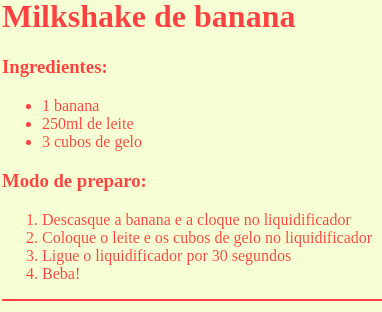
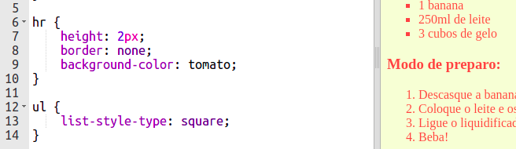

## Toques finais

Vamos acrescentar um pouco mais de HTML e CSS para aperfeiçoar a sua página de internet.

+ Você pode adicionar uma linha horizontal no final da sua receita, usando a tag `
`.

Observe que essa tag não tem uma tag final, como a tag ``.

+ A linha que você acabou de adicionar não corresponde ao estilo do restante da sua página de internet. Vamos corrigir isso adicionando alguns códigos CSS:

    hr {
        height: 2px;
        border: none;
        background-color: tomato;
    }
    

+ Você pode até mudar a aparência dos seus marcadores da lista com este código CSS:

    ul {
        list-style-type: square;
    }
    

