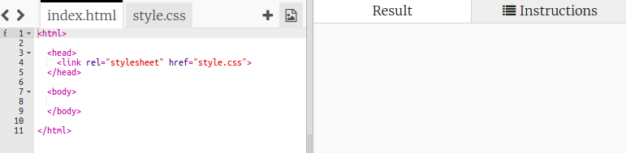

## Ingredientes

Vamos listar os ingredientes que vāo ser necessários para a tua receita.

+ Abre este trinket modelo: [jumpto.cc/html-template](http://jumpto.cc/html-template){:target="_blank"}.
    
    O projeto deve-se parecer com isto:
    
    

+ Para a tua lista de ingredients, vais usar uma **list desordenada**, usando a etiqueta `<ul>`. Go to line 8 of the template and add this HTML, replacing the text in the `<h1>` title with the name of your own recipe:

    <h1>Banana Milkshake</h1>
    
    <h3>Ingredients:</h3>
    
    <ul>
    
    </ul>
    

+ View your webpage, and you should see your two headings.

You won’t see your list yet though, because you haven’t added any list items to it!

+ The next step is to add list items into your list, by using the `<li>` tag. Add the following code inside your `<ul>` tag:

    <li>1 banana</li>
    

As your list is unordered, there are no numbers next to the list items, just bullet points.