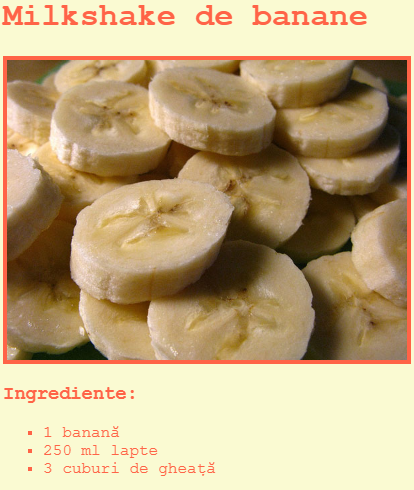

## Introducere

În acest proiect, vei învăța cum să creezi o pagină web pentru rețeta ta preferată.

### Informații suplimentare pentru conducătorii de club

Dacă vrei să printezi acest proiect, folosește [Versiunea printabilă](https://projects.raspberrypi.org/en/projects/recipe/print).

## \--- collapse \---

## title: Note pentru conducătorul clubului

## Introducere:

În acest proiect, copiii vor învăța cum despre liste HTML și culori CSS. Ei vor crea propria lor rețetă, adăugând liste cu ingrediente și metode.

## Resurse online

Recomandăm utilizarea [trinket](https://trinket.io/) pentru a scrie HTML & CSS online.

Copiii pot, de asemenea, să folosească acest trinket gol [(jumpto.cc/html-blank)](http://jumpto.cc/html-blank) pentru a scrie propriul cod HTML & CSS sau, alternativ, acest șablon trinket [(jumpto.cc/html-template)](http://jumpto.cc/html-template).

Există, de asemenea, un trinket care conține un exemplu de soluție pentru provocări:

+ [„Rețetă” completată -- trinket.io/html/c0fd9b40cd](https://trinket.io/html/c0fd9b40cd)

## Resurse offline

Acest proiect poate fi [completat offline](https://www.codeclubprojects.org/en-GB/resources/webdev-working-offline/) dacă dorești. Poți accesa resursele proiectului dând click pe link-ul „Materiale pentru proiect”. Acest link conține o secțiune „Resursele proiectului” ce include materialele de care copiii vor avea nevoie pentru realizarea proiectului offline. Asigură-te că fiecare copil are acces la câte o copie din aceste resurse. Secțiunea include următoarele fișiere:

+ template/index.html
+ template/style.css

De asemenea, poți găsi o versiune completă a provocărilor din acest proiect în secțiunea „Resursele voluntarilor”, care conține:

+ recipe-finished/index.html
+ recipe-finished/style.css
+ recipe-finished/banana.jpg

(Toate resursele de mai sus se pot descărca ca și fișiere `.zip` pentru proiecte și voluntari.)

## Obiective de învățare

+ Scrierea de cod HTML:
    
    + Etichetele pentru liste `<ul>`, `<ol>` și `<li>`;
    + Eticheta `
`;
    + Consolidarea folosirii de etichete înglobate.

+ Scrierea de cod CSS:
    
    + Culori (nume & coduri hexazecimale).

Acest proiect acoperă elemente din următoarele domenii ale curriculumului [Raspberry Pi Digital Making](http://rpf.io/curriculum):

+ [Proiectarea elementelor grafice 2D și 3D de bază](https://www.raspberrypi.org/curriculum/design/creator).

## Provocări

„Mai multe ingrediente” - adăugarea mai multor elemente într-o listă neordonată; „Mai mulți pași” - adăugarea mai multor elemente într-o listă ordonată; „Mai multe culori” - adăugarea numelor de culori, valori RGB și coduri hexazecimale; „Recenzii” - adăugarea unei alte liste nerodonate; „Mai mult stil” - adăugarea de imagini și fonturi.

## Completarea acestui proiect offline

Dacă copiii completează acest proiect offline, ei vor trebui să salvede imaginile pe care urmează să le folosească în același folder cu fișierul lor Template.html.

Ei pot să adauge doar numele fișierului în etichetele ``:

    
    

\--- /collapse \---

## \--- collapse \---

## title: Materiale pentru proiect

## Resursele proiectului

+ [fișier .zip care conține toate resursele proiectului](resources/recipe-project-resources.zip)
+ [Șablon Trinket online](http://jumpto.cc/trinket-template)
+ [Trinket online gol](http://jumpto.cc/trinket-blank)
+ [template/index.html](resources/template-index.html)
+ [template/style.css](resources/template-style.css)

## Resursele liderului de club

+ [fișier .zip care conține toate resursele proiectului, finalizate](resources/recipe-volunteer-resources.zip)
+ [Proiect Trinket online, finalizat](https://trinket.io/html/c0fd9b40cd)
+ [recipe-finished/index.html](resources/recipe-finished-index.html)
+ [recipe-finished/style.css](resources/recipe-finished-style.css)
+ [recipe-finished/banana.png](resources/recipe-finished-banana.png)

\--- /collapse \---