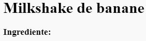
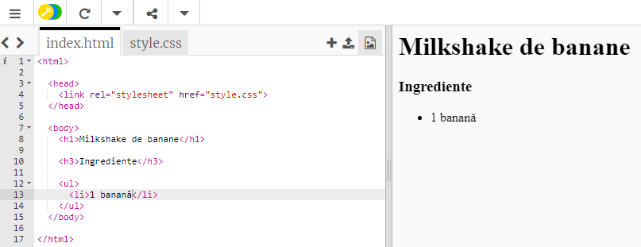

## Ingrediente

Hai să listăm ingredientele care sunt necesare pentru rețetă.

+ Deschide șablonul trinket: [jumpto.cc/html-template](http://jumpto.cc/html-template){:target="_blank"}.
    
    Proiectul ar trebui să arate astfel:
    
    

+ Pentru lista ta de ingrediente, vei folosi o **listă neordonată**, folosind eticheta `<ul>`. Mergi la linia 8 din șablon și adaugă acest cod HTML, înlocuind textul din titlul `<h1>` cu numele rețetei tale:

    <h1>Milkshake de banane</h1>
    
    <h3>Ingrediente:</h3>
    
    <ul>
    
    </ul>
    

+ Uită-te la pagina ta web, și ar trebui să vezi 2 titluri.

You won’t see your list yet though, because you haven’t added any list items to it!

+ The next step is to add list items into your list, by using the `<li>` tag. Add the following code inside your `<ul>` tag:

    <li>1 banana</li>
    

As your list is unordered, there are no numbers next to the list items, just bullet points.