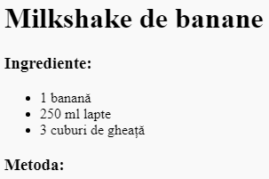
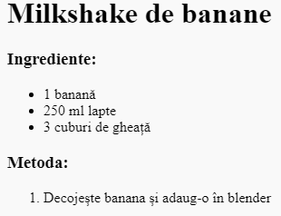

## Metoda

Acum, hai să explicăm cum se prepară rețeta ta.

+ Vei folosi o altă listă pentru a scrie metoda ta, dar de data aceasta vei folosi o **listă ordonată**, folosind eticheta `<ol>`.

O listă ordonată este o listă numerotată pe care ar trebui să o folosești când ordinea pașilor este importantă.

Adaugă acest cod sub lista ta de ingrediente, asigurându-te în același timp că este în interiorul etichetei `<body>`:

    <h3>Metoda:</h3>
    
    <ol>
    
    </ol>
    

+ Acum, trebuie doar să adaugi pași în noua ta listă ordonată:

    <li>Decojește banana și adaug-o în blender</li>
    

Nu uita că obiectele din listă sunt numerotate automat!