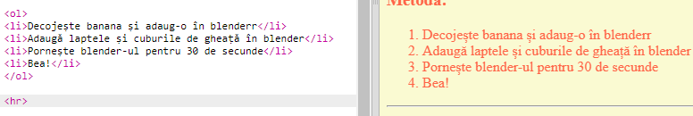
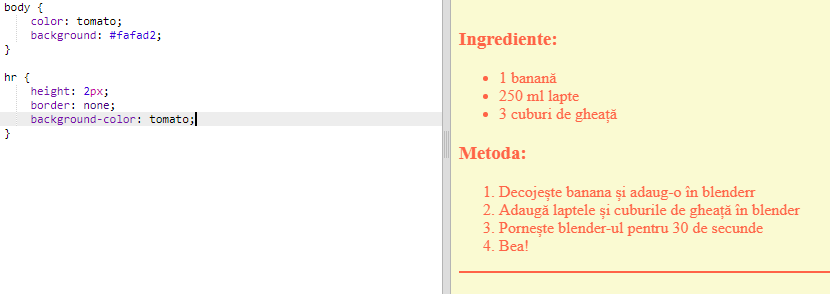
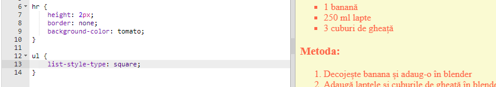

## Ultimele retușuri

Hai să adăugăm puțin cod HTML și CSS pentru a îmbunătăți pagina ta web.

+ Poți adăuga o linie orizontală la sfârșitul rețetei tale, folosind eticheta `
`.

Observă faptul că această etichetă nu are o etichetă pentru închidere, exact ca și eticheta ``.

+ Linia pe care tocmai ai adăugat-o nu se potrivește stilului paginii tale web. Hai să reparăm asta adăugând niște cod CSS:

    hr {
        height: 2px;
        border: none;
        background-color: tomato;
    }
    

+ Poți schimba chiar și cum arată punctele din listă cu codul CSS:

    ul {
        list-style-type: square;
    }
    

