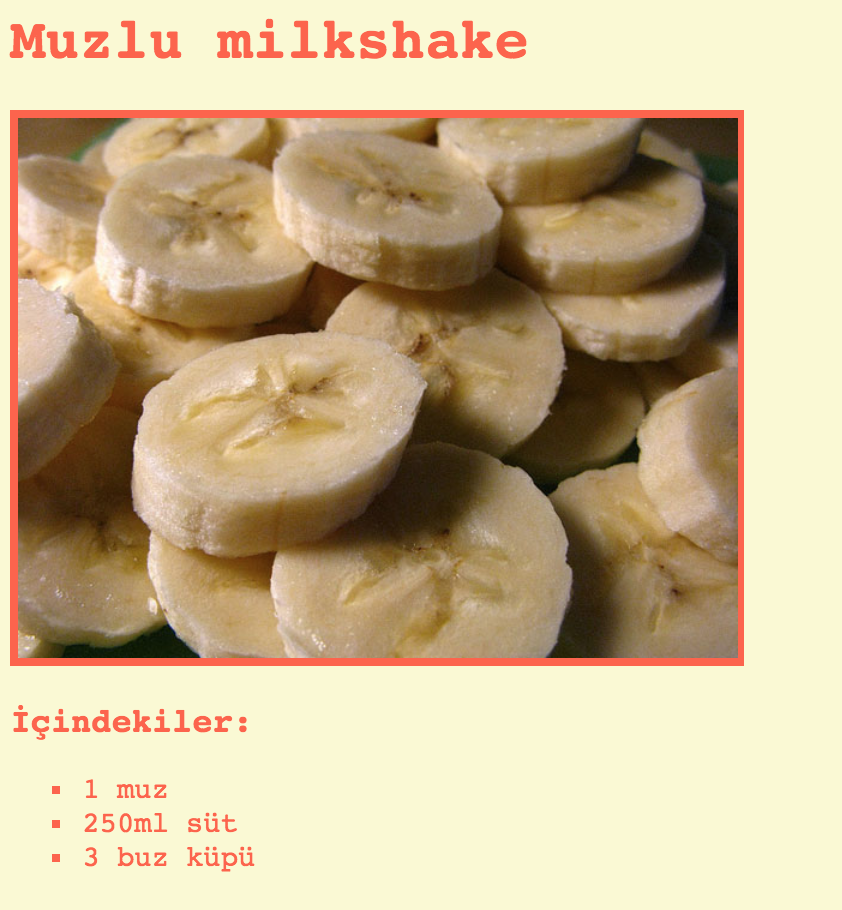

## Giriş

Bu projede, favori tarifiniz için nasıl bir web sayfası oluşturulacağını öğreneceksiniz.

### Kulüp liderleri için ek bilgiler

Bu projeyi yazdırmanız gerekiyorsa, lütfen [Yazıcı dostu sürümü](https://projects.raspberrypi.org/en/projects/recipe/print) kullanın.

## \--- küçült \---

## title: Kulüp lideri notları

## Giriş:

Bu projede çocuklar HTML listelerini ve CSS renklerini öğrenecekler. İçerik ve yöntem listeleri ekleyerek kendi tariflerini oluşturacaklar.

## Çevrimiçi kaynaklar

Çevrimiçi HTML & CSS yazmak için [biblo](https://trinket.io/) kullanmanızı öneririz.

Çocuklar kendi HTML & CSS 'leri yazmak için ayrıca bu boş trinket'lardan [(jumpto.cc/html-blank)](http://jumpto.cc/html-blank) yararlanabilirler ya da alternatif olarak şu şablon trinket 'ı da [(jumpto.cc/html-template)](http://jumpto.cc/html-template) kullanabilirler.

Ayrıca meydan okumalara örnek bir çözüm içeren trinket da var:

+ ['Tarif' Tamamlandı - trinket.io/html/c0fd9b40cd](https://trinket.io/html/c0fd9b40cd)

## Çevrimdışı Kaynaklar

Bu proje, istenirse [çevrimdışı](https://www.codeclubprojects.org/en-GB/resources/webdev-working-offline/) olarak tamamlanabilir. Proje kaynaklarına, bu proje için 'Proje Malzemeleri' bağlantısını tıklayarak erişebilirsiniz. Bu link, çocukların bu projeyi çevrimdışı tamamlamaları için ihtiyaç duyacağı kaynakları içeren bir 'Proje Kaynakları' bölümü içermektedir. Her çocuğun bu kaynakların bir kopyasına erişimi olduğundan emin olun. Bu bölüm aşağıdaki dosyaları içerir:

+ Şablon / index.html
+ Şablon / style.css

Bu projenin zorluklarının tamamlanmış bir versiyonunu da içeren 'Gönüllü Kaynaklar' bölümünde bulabilirsiniz:

+ tarifi mamul / index.html
+ tarifi mamul / style.css
+ tarifi mamul / banana.jpg

(Yukarıdaki kaynakların tümü proje olarak da indirilebilir ve gönüllü `.zip` dosyadır)

## Öğrenme hedefleri

+ HTML yazma:
    
    + `<ul>`, `<ol>` ve `<li>` liste etiketlerini;
    + `
` etiketi;
    + Yuvalanmış etiketlerin kullanımını birleştirme.

+ CSS Yazma:
    
    + Renkler ( & onaltılık kodları adlandırır).

Bu proje, [Raspberry Pi Digital Making Curriculum](http://rpf.io/curriculum) 'un aşağıdaki bölümlerinden unsurları kapsamaktadır:

+ [Temel 2B ve 3B varlıkların tasarlanması](https://www.raspberrypi.org/curriculum/design/creator).

## Meydan Okumalar

"Diğer içerikler" - sıralanmamış bir listeye daha fazla öğe ekleme; "Diğer adımlar" - sıralı bir listeye daha fazla öğe ekleyerek; "Daha fazla renk" - renk adları, rgb değerleri ve onaltılık kodlar ekleme; "Yorumlar" - sıralanmamış bir liste ekleyerek; "Daha fazla stil" - resim ve yazı tipi ekleme.

## Bu projeyi çevrimdışı tamamlama

Çocuklar bu projeyi çevrimdışı olarak tamamlıyorsa, kullanmak istedikleri görüntüleri Template.html dosyasıyla aynı klasörde kaydetmeleri gerekir.

Daha sonra `` etiketlerine dosyanın adını ekleyebilirler:

    
    

\--- /collapse \---

## \--- collapse \---

## title: Proje materyalleri

## Proje kaynakları

+ [tüm proje kaynaklarını içeren .zip dosyası](resources/recipe-project-resources.zip)
+ [Çevrimiçi Biblo şablonu](http://jumpto.cc/trinket-template)
+ [Çevrimiçi boş biblo](http://jumpto.cc/trinket-blank)
+ [Şablon / index.html](resources/template-index.html)
+ [Şablon / style.css](resources/template-style.css)

## Kulüp lideri için kaynaklar

+ [tamamlanan tüm proje kaynaklarını içeren .zip dosyası](resources/recipe-volunteer-resources.zip)
+ [Online biblo projesi tamamlandı](https://trinket.io/html/c0fd9b40cd)
+ [tarifi mamul / index.html](resources/recipe-finished-index.html)
+ [tarifi mamul / style.css](resources/recipe-finished-style.css)
+ [tarifi mamul / banana.png](resources/recipe-finished-banana.png)

\--- /collapse \---