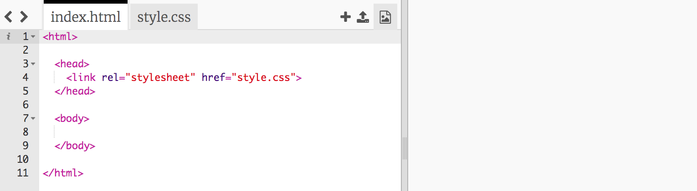
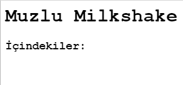

## malzemeler

Tarifiniz için gereken malzemeleri listeleyelim.

+ Bu trinket şablonunu açın: [jumpto.cc/html-template](http://jumpto.cc/html-template){:target="_blank"}.
    
    Proje şöyle görünmeli:
    
    

+ İçindekiler listeniz için `<ul>` etiketini kullanarak **sırasız bir liste** kullanacaksınız. Şablonun 8. satırına gidin ve bu HTML'yi ekleyin, `<h1>` başlığındaki metni kendi tarifinizin adıyla değiştirin:

    <h1>Banana Milkshake</h1>
    
    <h3>İçindekiler:</h3>
    
    <ul>
    
    </ul>
    

+ Web sayfanızı görüntüleyin, iki başlığınızı da görmelisiniz.

Fakat listenizi henüz göremezsiniz, çünkü listeye herhangi bir eleman eklemediniz!

+ Sonraki adım, `<li>` etiketini kullanarak listenize liste elemanları eklemektir. `<ul>` etiketinizin içine aşağıdaki kodu ekleyin:

    <li>1 muz</li>
    

Listeniz sırasız olduğundan, liste öğelerinin yanında sayı yoktur, yalnızca madde işareti vardır.