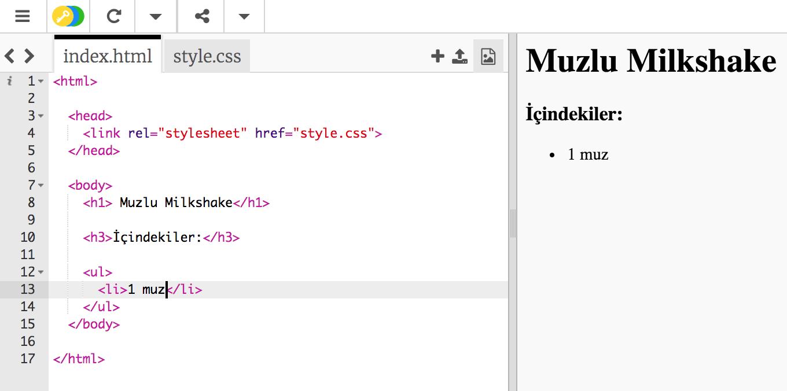

## malzemeler

Tarifiniz için gereken malzemeleri listeleyelim.

+ Bu şablonu bibloyu aç: [jumpto.cc/html-template](http://jumpto.cc/html-template){: target = "_ blank"}.
    
    Proje şöyle görünmeli:
    
    

+ İçerik listeniz için, `<ul>` etiketini kullanarak **sırasız bir liste**kullanacaksınız. Şablonun 8. satırına gidin ve bu HTML'yi ekleyin, `<h1>` başlığındaki metni kendi tarifinizin adıyla değiştirin:

    <h1>Muzlu Milkshake</h1>
    
    <h3>Malzemeler:</h3>
    
    <ul>
    
    </ul>
    

+ Web sayfanızı görüntüleyin ve iki başlığınızı görmelisiniz.

Yine de listenizi göremezsiniz, çünkü listeye herhangi bir liste öğesi eklemediniz!

+ Sonraki adım, `<li>` etiketini kullanarak listenize liste öğeleri eklemektir. `<ul>` etiketinizin içine aşağıdaki kodu ekleyin:

    <li>1 muz</li>
    

Listeniz sırasız olduğundan, liste öğelerinin yanında sayı yoktur, yalnızca madde imleci vardır.