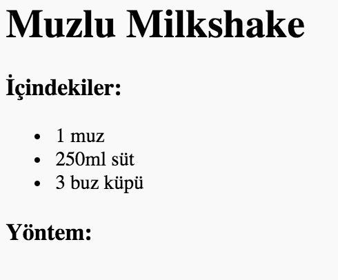
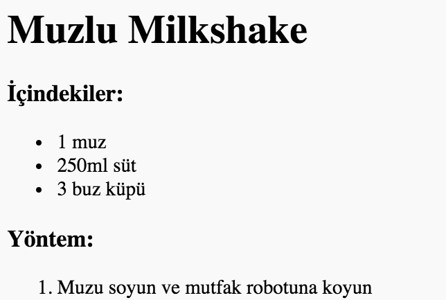

## Yöntem

Şimdi, tarifinizi nasıl yapacağınızı açıklayalım.

+ Yönteminizi yazmak için başka bir liste kullanacaksınız, ancak bu kez `<ol>` etiketini kullanarak **sıralı liste** kullanıyor olacaksınız.

Sıralı liste, adım sırası önemli olduğunda kullanmanız gereken numaralı bir listedir.

Hala `<body>` etiketi içinde olduğuna emin olarak bu kodu içindekiler listenizin altına ekleyin:
```
    <h3>Yöntem:</h3>
    
    <ol>
    
    </ol>
```    



+ Şimdi liste elemanlarını yeni sıralı listene eklemelisiniz:
```
    <li>Muzu soyun ve mutfak robotuna koyun</li>
```   



Liste elemanlarının otomatik olarak numaralandırıldığına dikkat edin!