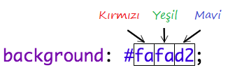

## Renkler!

Tarif web sayfanıza biraz renk ekleyelim.

+ Bir web sayfasına nasıl renkli metin ekleneceğini zaten öğrendiniz. Web sitesi gövdesindeki tüm metni mavi yapmak için bu kodu `style.css` dosyanızın içine ekleyin:

    body {
        color: blue;
    }
    

+ Tarayıcınız `mavi`, `sarı` ve hatta `lightgreen` gibi renkleri bilir, ancak tarayıcınızın aslında 140'tan fazla rengin **ismini** bildiğini biliyor muydunuz?

Kullanabileceğiniz tüm renk isimlerinin bir listesi var: [jumpto.cc/colours](http://jumpto.cc/colours), `tomato`, `firebrick` ve `peachpuff` gibi renk isimlerini içerir.

Metin rengini `blue`'dan `tomato`'ya çevirin.

+ Tarayıcınız 140 adet renk ismi bilir, fakat aslında 16 milyondan fazla rengin **renk değerlerini** de biliyor!

Tarayıcıya hangi rengin gösterileceğini söylemek için, ne kadar kırmızı, yeşil ve mavi kullanacağını ona bildirmeniz yeterlidir.

Kırmızı, yeşil ve mavi miktarları `0` ile `255` arasında bir sayı olarak yazılır.

Açık sarı bir arka plan görüntülemek için bu kodu web sayfasının gövdesi için CSS'ye ekleyin:

    background: rgb(250,250,210);
    

+ İsterseniz, onaltılık bir kod (veya **heksadesimal kod**) kullanarak tarayıcıya hangi rengin görüntüleneceğini söyleyebilirsiniz. Bu yukarıdaki `rgb()` koduna benzer bir şekilde çalışır, tek farkı heksadesimal kodlar her zaman `#` ile başlar ve kırmızı, yeşil ve mavi miktarı için `00` ve `ff` arası heksadesimal bir değer verilir.

CSS'inizdeki `rgb ()` kodunu bu heksadesimal kodla değiştirin:

    background: #fafad2;
    

Daha önce olduğu gibi aynı açık sarı rengini görmelisiniz!