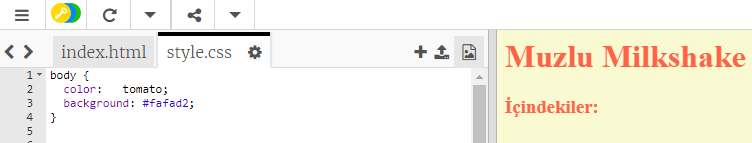

## Renkler!

Tarif web sayfanıza biraz renk ekleyelim.

+ Bir web sayfasına nasıl renkli metin ekleneceğini zaten öğrendiniz. Web sitesi gövdesindeki tüm metni mavi yapmak için bu kodu `style.css` dosyanızın içine ekleyin:

    gövde {
        renk: mavi;
    }
    

+ Tarayıcınız gibi renkleri bilir `mavi`, `sarı` ve hatta `lightgreen`, ancak tarayıcınızı aslında bildiği biliyor muydunuz **isim** 140 üzerinde farklı renklerde?

Kullanabileceğiniz tüm renk adlarının bir listesi var: `domates`, `firebrick` ve `şeftali`gibi renk adlarını içeren [jumpto.cc/colours](http://jumpto.cc/colours).

Metin rengini `mavi` `domates`.

+ Tarayıcınız 140 renk isimlerini bilen, ama aslında bilir **renk değerlerini** 16 milyondan fazla renk!

Tarayıcıya hangi rengin gösterileceğini söylemek için, ne kadar kırmızı, yeşil ve mavi kullanacağını bilmeniz yeterlidir.

Kırmızı, yeşil ve mavi miktarları `0` ile `255`arasında bir sayı olarak yazılır.

Açık sarı bir arka plan görüntülemek için bu kodu web sayfasının gövdesi için CSS'ye ekleyin:

    arkaplan: rgb (250,250,210);
    

+ İsterseniz, tarayıcıya onaltılık bir kod (veya **onaltılık kod**) kullanarak hangi rengin görüntüleneceğini söyleyebilirsiniz. Bu benzer bir şekilde çalışır `rgb ()` o altıgen kodları her zaman başlamak dışında yukarıda kod `#`ve arasında, onaltılık numaralarını kullanabilirsiniz `00` ve `ff` kırmızı, yeşil miktarı için ve mavi.

CSS'nizdeki `rgb ()` kodunu bu hex koduyla değiştirin:

    arkaplan: # fafad2;
    

Daha önce olduğu gibi aynı açık sarı görmelisin!