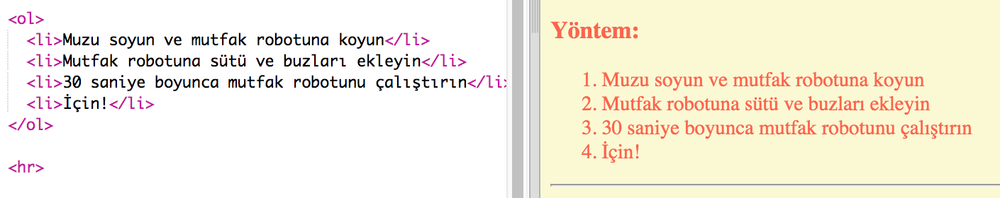
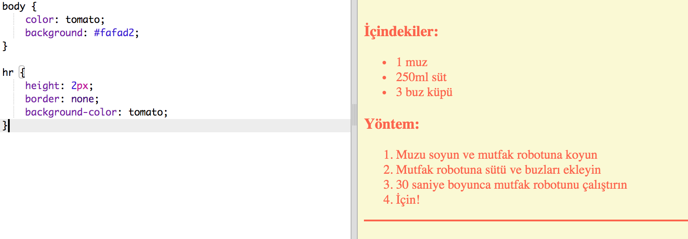
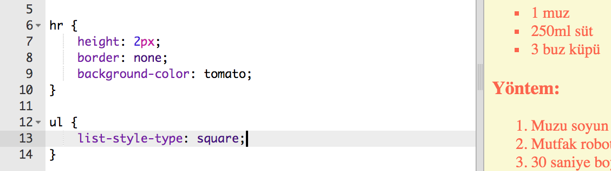

## Son rötuşları

Web sayfanızı geliştirmek için biraz daha HTML ve CSS ekleyelim.

+ `
` etiketini kullanarak tarifinizin sonuna yatay bir çizgi ekleyebilirsiniz.

Bu etiketin, `` etiketi gibi bir bitiş etiketi olmadığına dikkat edin.

+ Yeni eklediğiniz satır, web sayfanızın geri kalanıyla aynı değil. Biraz CSS kodu ekleyerek düzeltelim:

    saat {
        yükseklik: 2 piksel;
        sınır: yok;
        arka plan rengi: domates;
    }
    

+ Madde imli noktalarınızın bu CSS koduyla nasıl göründüğünü bile değiştirebilirsiniz:

    ul {
        liste tarzı türü: kare;
    }
    

