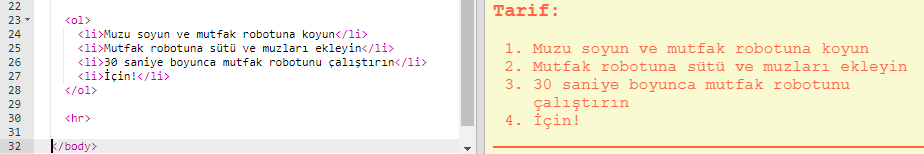
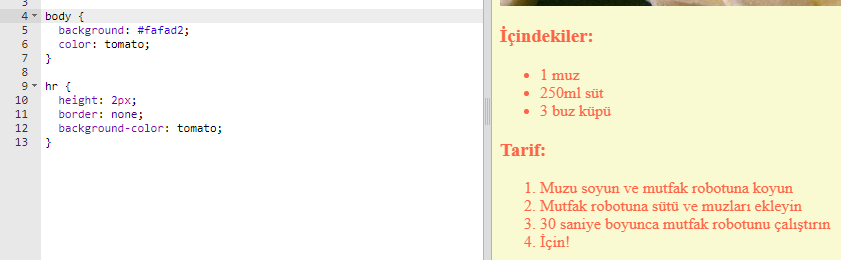

## Son rötuşlar

Web sayfanızı geliştirmek için biraz daha HTML ve CSS ekleyelim.

+ `
` etiketini kullanarak tarifinizin sonuna yatay bir çizgi ekleyebilirsiniz.

Bu etiketin, `` etiketi gibi bir bitiş etiketine sahip olmadığına dikkat edin.

+ Yeni eklediğiniz satır, web sayfanızın geri kalanına uymuyor. Hadi bunu biraz CSS kodu ekleyerek düzeltelim:

    hr {
        height: 2px;
        border: none;
        background-color: tomato;
    }
    

+ Bu CSS koduyla madde işaretlerinizin nasıl gözüktüğünü bile değiştirebilirsiniz:

    ul {
        list-style-type: square;
    }
    

