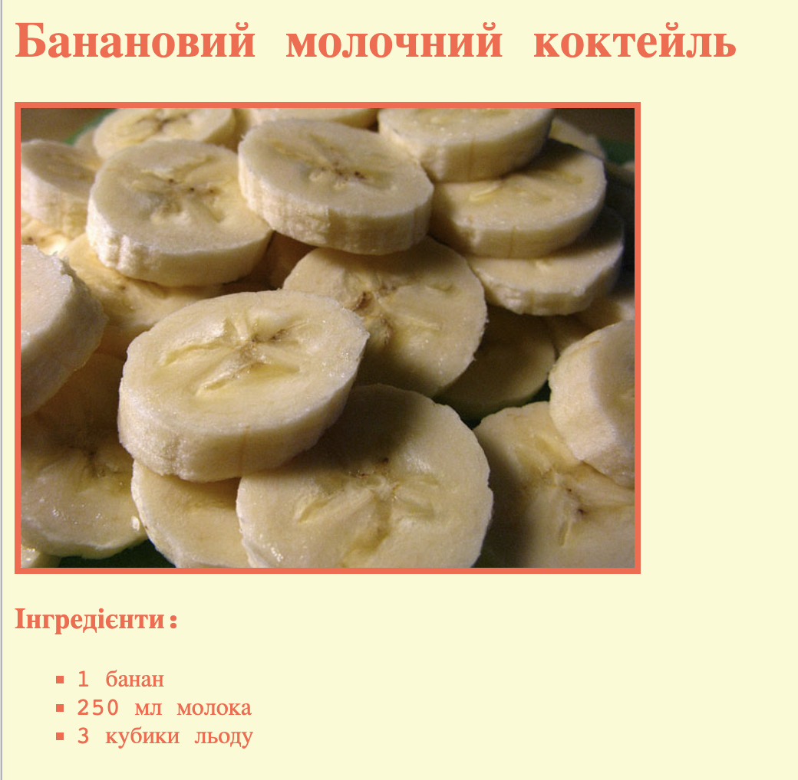

\--- challenge \---

## Завдання: більше стилів

Чи можеш ти додати зображення на свою веб-сторінку? Або змінити шрифт? Ось як може виглядати твоя веб-сторінка:

Тобі допоможе наступний код:

    font-family: Arial / Comic Sans MS / Courier / Impact / Tahoma;
    font-size: 12pt;
    font-weight: bold;
    
    
    

\--- /challenge \---