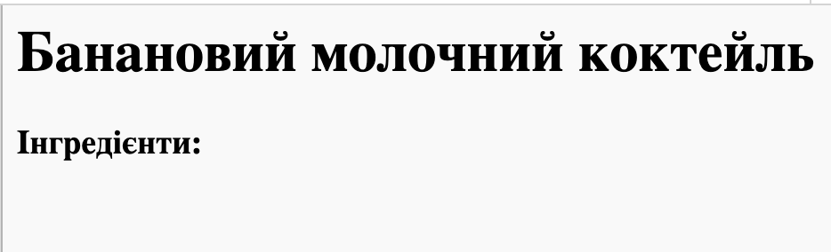
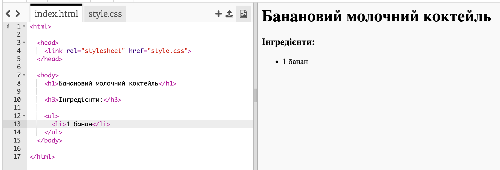

## Інгредієнти

Давай перерахуємо інгредієнти, необхідні для твого рецепта.

+ Відкрий цей шаблон: [jumpto.cc/html-template](http://jumpto.cc/html-template){:target="_blank"}.
    
    Проєкт повинен виглядати так:
    
    

+ Для списку інгредієнтів ти використовуватимеш **неупорядкований список** за допомогою тегу `<ul>`. Перейди до рядка 8 шаблону та додай цей HTML-код, замінивши текст у заголовку `<h1>` title на назву свого рецепта:

    <h1>Банановий молочний коктейль</h1>
    <h3>Інгредієнти:</h3>
    <ul>
    </ul>
    

+ Переглянь свою веб-сторінку. Ти маєш побачити два свої заголовки.

Ти поки шо не побачиш список, оскільки ти ще не додав/-ла до нього жодного пункту!

+ Наступним кроком буде додавання до списку пунктів за допомогою тегу `<li>`. Додай наступний код у тег `<ul>`:

    <li>1 банан</li>
    

Оскільки твій список неупорядкований, поряд із пунктами списку немає чисел, а лише маркери.