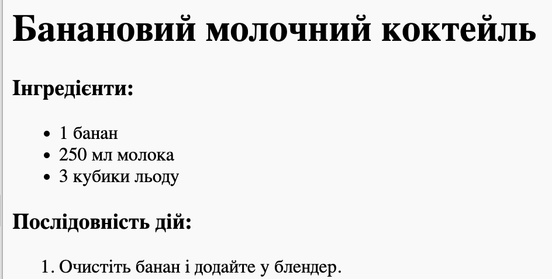

## Кроки

Далі давай пояснимо, що треба робити в твоєму рецепті.

+ Ти використовуватимеш ще один список, щоб перерахувати потрібні кроки, але на цей раз ти використаєш ** упорядкований список** за допомогою тегу `<ol>`.

Упорядкований список — це нумерований список, який використовується тоді, коли важливий порядок дій.

Напиши цей код під списком інгредієнтів, переконавшись, що він все ще міститься всередині тега `<body>`:

    <h3>Кроки:</h3>
    <ol>
    </ol>
    

+ Тепер тобі просто потрібно додати пункти до свого нового списку:

    <li>Очистіть банан і додайте у блендер.</li>
    

Зверніть увагу, що елементи списку нумеруються автоматично!