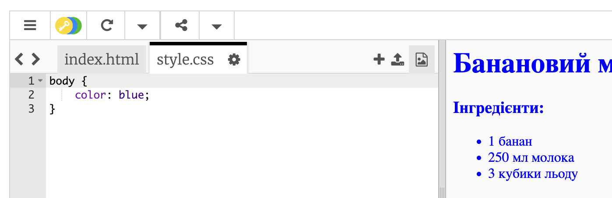
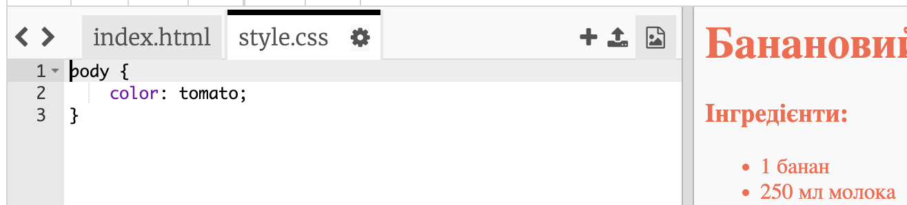
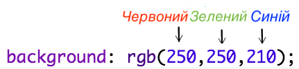
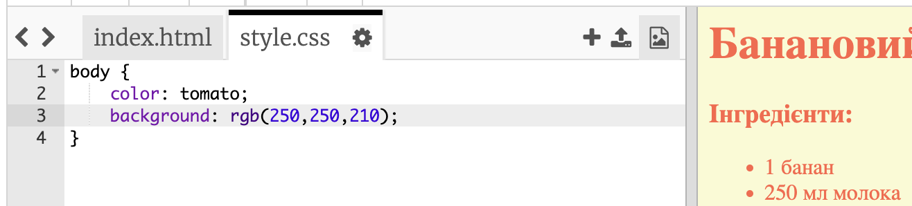
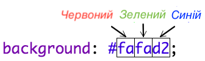
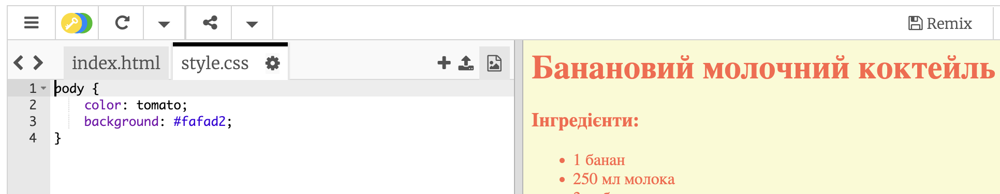

## Кольори!

Давай додамо трохи кольору до веб-сторінки твого рецепта.

+ Ти вже навчився/-лася додавати кольоровий текст до веб-сторінки. Додай цей код у свій файл `style.css`, щоб зробити весь текст на веб-сторінці синім:

    body {
        color: blue;
    }
    

+ Твій браузер знає такі кольори, як `blue` (синій), `yellow` (жовтий) і навіть `lightgreen` (світло-зелений), але чи знаєш ти, що він знає **назви** понад 140 різних кольорів?

Тут є список всіх кольорів, які ти можеш використовувати: [jumpto.cc/colours](http://jumpto.cc/colours). Там є такі назви кольорів, як `tomato` (томатний), `firebrick` (цегляний) та `peachpuff` (персиковий).

Зміни колір тексту з `синього` на `томатний`.

+ Твій браузер знає назви 140 кольорів, але насправді йому відомі **числові значення** більше 16 мільйонів кольорів!

Щоб браузер знав, який колір відображати, потрібно просто сказати йому кількість червоного, зеленого та синього кольорів.

Кількість червоного, зеленого та синього кольорів записується числом між `0` та `255`.

Додай цей код до стилів CSS для структури веб-сторінки, щоб відобразити світло-жовтий фон:

    background: rgb(250,250,210);
    

+ За бажанням ти можеш вказати браузеру колір за допомогою шістнадцяткого коду (або **hex-коду**). ВІн працює подібно до коду `rgb()` (як у попередньому прикладі), але шістнадцяткові коди завжди починаються з `#` та використовують шістнадцяткові числа між `00` та `ff` на позначення кількості червоного, зеленого та синього.

Заміни код `rgb()` у своєму файлі CSS на цей шістнадцятковий код:

    background: #fafad2;
    

Ти маєш побачити той же світло-жовтий колір, як і раніше!