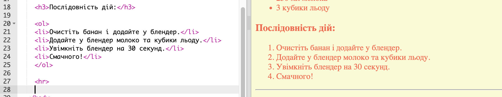
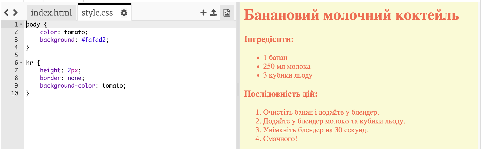
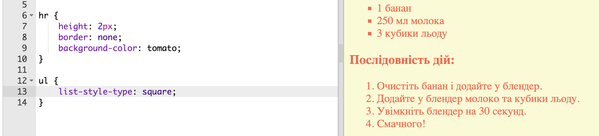

## Останні штрихи

Давайте додамо трохи більше HTML та CSS для покращення вашої веб-сторінки.

+ Ви можете додати горизонтальну лінію в кінці свого рецепта, використовуючи `
`тег.

Зверніть увагу, що цей тег не має кінцевого тегу, як і `` тег.

+ Щойно додана вами лінія не відповідає стилю решти веб-сторінки. Давайте виправимо це, додавши який-небудь код CSS:

    hr {
         висота: 2шт;
         ширина: немає;
         фоновий колір: томатний;
    }
    

+ Ви навіть можете змінити те, як виглядають ваші розмітки за допомогою цього коду CSS:

    ul {
        список-стилю-виду: квадрат ; 
    }
    

