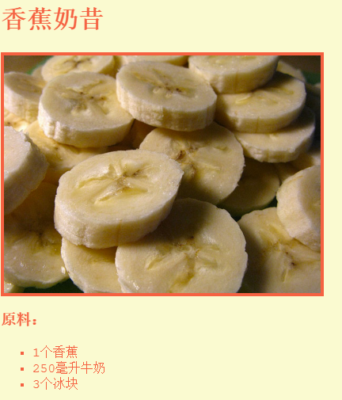

--- challenge ---

## 挑战：更多样式

你可以在你的网页上添加图片吗？ 或者改变字体？ 你的网页可以是这样的：



这里有一些代码可能会帮到你：
```
    font-family: Arial / Comic Sans MS / Courier / Impact / Tahoma;
    font-size: 12pt;
    font-weight: bold;
    
    
```    

--- /challenge ---


***
该项目由以下志愿者翻译：

齐琨

Annie Ji

正因为志愿者们的辛勤工作，我们才能为世界各地的人们提供用母语来学习的机会。您也可以通过志愿翻译工作来帮助我们吸引更多的人 - 更多信息，请访问[rpf.io/translate](https://rpf.io/translate)。