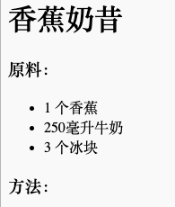
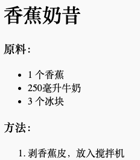

## 方法

接下来，让我们来解释一下如何制作你的食谱。

+ 你将使用另一个列表来编写你的方法，但是这一次你将使用**有序列表**，用`<ol>`标签表示。

有序列表是一个编号列表，当步骤的顺序很重要时，你应该使用它。

在你的原料列表下面添加这个代码，确保它仍然在你的`<body>`标签：

    <h3>方法：</h3>
    
    <ol>
    
    </ol>
    

+ 现在你只需要添加列表项目到新的有序列表：

    <li>剥香蕉皮，放入搅拌机</li>
    

注意，列表项是自动编号的！