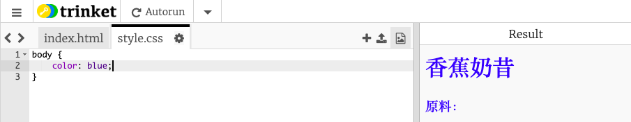
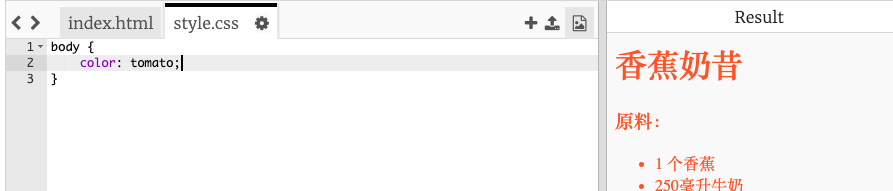
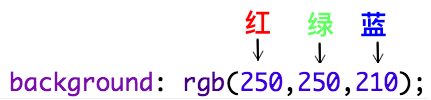
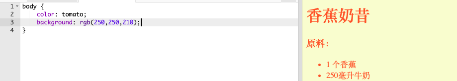
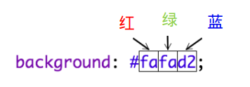
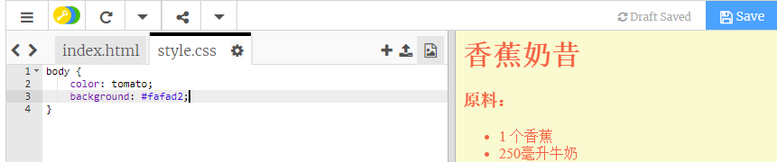

## 颜色！

让我们为你的食谱网页添加一些颜色。

+ 你已经学习了如何将彩色文本添加到网页中。 将此代码添加到 `style.css` 文件，使网站中所有的文本都变成蓝色：
```
    body {
        color: blue;
    }
```    



+ 你的浏览器能识别的颜色有`blue`（蓝色）， `yellow`（黄色），甚至`lightgreen`（亮绿色），但是你知道你的浏览器实际上认识140多种不同的颜色**名称**吗？

这里有一个你可以使用的所有颜色名称的列表：[jumpto.cc/colours](http://jumpto.cc/colours), 包括像`tomato`（西红柿）， `firebrick`（耐火砖）和 `peachpuff`（桃色）的颜色名称。

把文本颜色从 `blue` 变成 `tomato`。



+ 你的浏览器知道140种颜色的名称，但实际上它也知道超过1600万种颜色的**颜色值**（colour values）！

要告诉浏览器显示什么颜色，只需让它知道要使用多少红色、绿色和蓝色。

红色、绿色和蓝色的数量以 `0` 到 `255` 之间的数字表示。



将此代码添加到网页主体的CSS中，显示淡黄色背景：
```
    background: rgb(250,250,210);
```    



+ 如果你愿意，可以使用十六进制代码（**hex code**）告诉浏览器显示哪种颜色。 这与上面的 `rgb()` 代码的工作方式类似，区别是十六进制代码总是以 `#` 开始，并且使用 `00` 到 `ff` 之间的十六进制“数字”表示红色、绿色和蓝色的数量。



在你的CSS中把 `rgb()` 代码改成十六进制代码：
```
    background: #fafad2;
```    



你应该看到和以前一样的淡黄色！