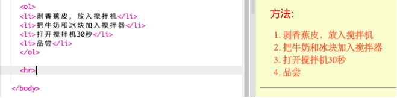

## 最后一步

让我们再添加一点HTML和CSS来改进你的网页。

+ 你可以使用`<hr>`标签在食谱的末尾添加一条水平线。



注意，这个标签没有结束标签，就像``标记一样。

+ 你刚刚添加的行与你的其他页面样式不匹配。 让我们通过添加一些CSS代码来解决这个问题：
```
    hr {
        height: 2px;
        border: none;
        background-color: tomato;
    }
```    


+ 你甚至可以通过这个CSS代码来改变项目符号的形状：
```
    ul {
        list-style-type: square;
    }
```    

