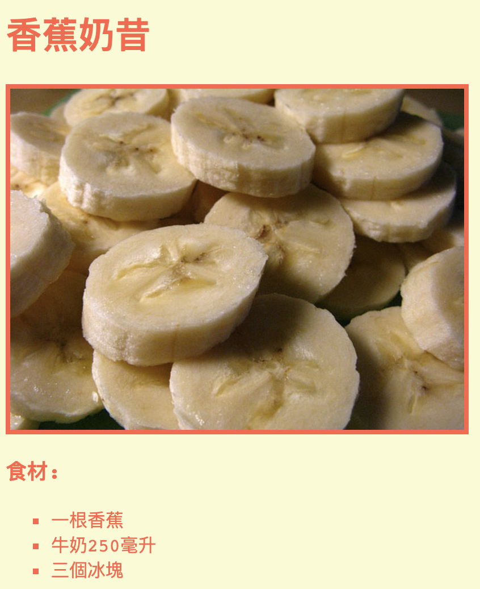

## 介紹

在這個項目中，你將學習如何為你最喜歡的食譜創建一個網站。

### 目前項目的額外資訊：

如果你需要列印這個專案，可以先切換成[友好列印模式](https://projects.raspberrypi.org/zh-TW/projects/recipe/print)。

--- collapse ---
---
title: 給教師的其它資訊
---
## 介紹:

在這個項目中，孩子們將學習 HTML列表和CSS顏色。 他們會創建自己的食譜、添加的食材和作法列表。

## 線上資源

我們建議使用[trinket](https://trinket.io/)來在線編寫HTML &CSS的代碼

孩子們也可以利用這個空白trinket [（jumpto.cc/html-blank）](http://jumpto.cc/html-blank) 來編寫自己的HTML & CSS，或是他們也可以使用這個模板trinket [（jumpto.cc/html-template）](http://jumpto.cc/html-template)。

這個trinket 包含挑戰樣本的解決方案：

+ [完成的“食譜” --trinket.io/html/c0fd9b40cd](https://trinket.io/html/c0fd9b40cd)

## 離線資源

根據個人喜好，你也可以[離線完成](https://www.codeclubprojects.org/en-GB/resources/webdev-working-offline/)此專案。 你可以從此項目的「項目材料」連結訪問項目資源。 這個連結包含了'項目資源'，裡面有孩子們離線完成這個項目所需要的資源。 請確保每個孩子都可以取得這些資源的副本。 這個部分包括以下文件：

+ template/index.html
+ template/style.css

你還可以在「志工資源」部分中找到該項目挑戰的完整版，裡面包含：

+ recipe-finished/index.html
+ recipe-finished/style.css
+ recipe-finished/banana.jpg

(以上所有資源也能以項目和志工的壓縮檔案`.zip`來下載。)

## 學習目標

+ 編寫HTML：
    
    + `<ul>`, `<ol>` 和 `<li>` 列表標籤；
    + `
` 標籤；
    + 鞏固嵌套標籤的使用

+ 編寫CSS：
    
    + 顏色(名稱 & 十六進制表示方式)

本項目從以下各方面內容涵蓋了[Raspberry Pi 數位製作課程](http://rpf.io/curriculum)：

+ [設計基本的2D和3D資源](https://www.raspberrypi.org/curriculum/design/creator)。

## 挑戰

“更多食材”-將更多項目添加到無序列表中； “更多步驟”-將更多項目添加到有序列表中； “更多顏色”-添加顏色名稱，rgb值和十六進制代碼； “評論”-添加另一個無序列表； “更多樣式”-添加圖片和字體。

## 離線完成這個項目

如果孩子們離線完成了這個項目，他們需要將打算使用的圖片保存在與Template.html檔案相同的資料夾中。

接著他們可以在 ``標籤中加上文件的名稱：

    
    

--- /collapse ---

--- collapse ---
---
title: 項目材料
---
## 項目資源

+ [包含所有項目資源的.zip壓縮檔](https://rpf.io/p/zh-TW/recipe-go)
+ [線上Trinket模板](http://jumpto.cc/trinket-template)
+ [線上空白Trinket](http://jumpto.cc/trinket-blank)
+ [template/index.html](resources/template-index.html)
+ [template/style.css](resources/template-style.css)

## 俱樂部領導者資源

+ [包含所有已完成項目資源的.zip壓縮檔](https://rpf.io/p/zh-TW/recipe-go)
+ [線上完成的Trinket專案](https://trinket.io/html/c0fd9b40cd)
+ [recipe-finished/index.html](resources/recipe-finished-index.html)
+ [recipe-finished/style.css](resources/recipe-finished-style.css)
+ [recipe-finished/banana.png](resources/recipe-finished-banana.png)

--- /collapse ---