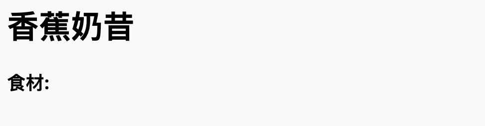
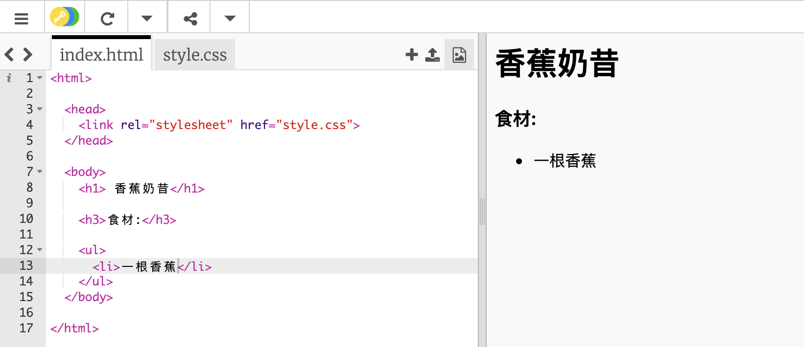

## 食材

讓我們一起列出你的食譜所需要的食材。

+ 打開 trinket模板: [jumpto.cc/html-template](http://jumpto.cc/html-template){:target="_blank"}.
    
    檔案看起來應該像這樣︰
    
    

+ 你的食材列表將使用**無序列表**並用`<ul>`標籤。 到模板的第8行並添加這個HTML，將 `<h1>` 標題中的文本替換成你的食譜名稱：

    <h1>香蕉奶昔</h1>
    
    <h3>食材： </h3>
    
    <ul>
    
    </ul>
    

+ 查看你的網頁，你應該會看到你的兩個標題。

你現在看不到你的列表，因為你還沒添加任何列表項目！

+ 下一步是使用`<li>` 標籤將列表項目加進列表中。 將下面的代碼加進你的`<ul>` 標籤中：

    <li> 1根香蕉</li>
    

由於這是無序列表，所以列表項目旁邊沒有數字，只有要點符號。