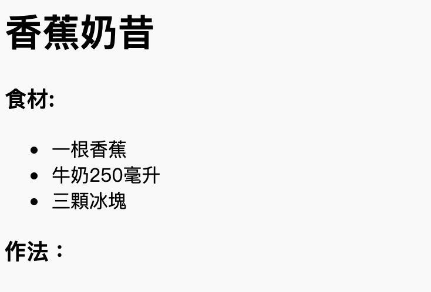
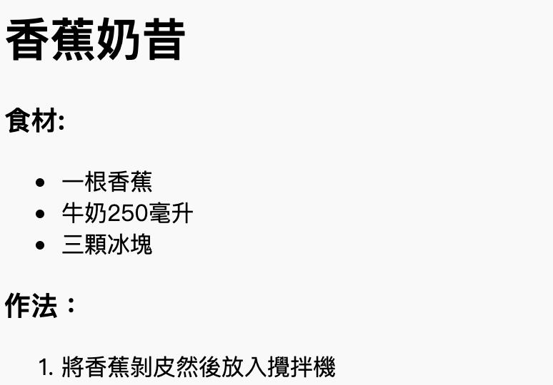

## 作法

接下來，讓我來解釋一下如何製作你的食譜。

+ 你要使用另一個列表來編寫你的作法，但這次你要通過`<ol>` 標籤來使用**有序料表**

有序列表是一個有編號的列表，當你認為步驟的順序很重要時你就該使用它。

在你的食材列表下面添加這個代碼，確保他仍然在你的 `<body>` 標籤裡：

    <h3>作法：</h3>
    
    <ol>
    
    </ol>
    

+ 現在你只需要在你新的有序列表中添加列表項目：

    <li>把香蕉皮剝掉並放進攪拌機</li>
    

注意，列表項目會自動編號！