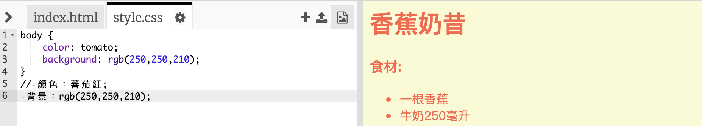

## 顏色！

讓我們為你的食譜網頁添加一些顏色。

+ 你已經學過了如何將彩色的文本加到網頁中。 將這個代碼加進你的 `style.css`檔案，使網站裡的所有文本都變成藍色：

    body {
        color: blue;
    }
    

+ 你的瀏覽器知道的顏色有 `藍色`,，`黃色` 甚至是 `亮綠色`，但是你知道實際上你的瀏覽器知道超過140種顏色的**名字**嗎？

這是一個你能夠使用的所有顏色名稱列表： [jumpto.cc/colours](http://jumpto.cc/colours)，裡面包含像 `tomato蕃茄紅`，`firebrick火磚色` 和`peachpuff粉蜜桃色`的顏色名稱。

將文本顏色從`blue藍色` 改成 `tomato蕃茄紅`.

+ 你的瀏覽器知道140種顏色的名稱，但實際上它知道超過1600萬種顏色的**色彩值**！

要告訴瀏覽器顯示哪個顏色，你只需要讓它知道要使用多少紅色、綠色和藍色。

紅色、綠色和藍色的數量以`0` 到 `255`之間的數字表示。

將這個代碼加到網頁主體的CSS 中，顯示出淡黃色的背景：

    background: rgb(250,250,210);
    

+ 如果你願意，你可以使用十六進制碼（或 **hex code**）來告訴瀏覽器要顯示哪個顏色。 這個作業方式與上面的 `rgb()` 代碼類似，區別是十六進制代碼總是以`#`開始，並且使用 `00`到 `ff`之間的十六進制“數字”來表示紅色、綠色和藍色的數量。

在你的CSS中把 `rgb()` 代碼改成十六進制代碼：

    background: #fafad2;
    

你應該看到跟之前一樣的淡黃色！