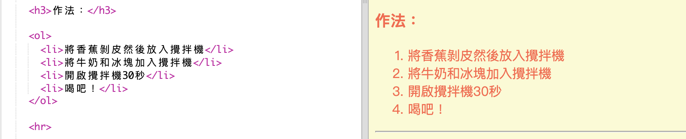
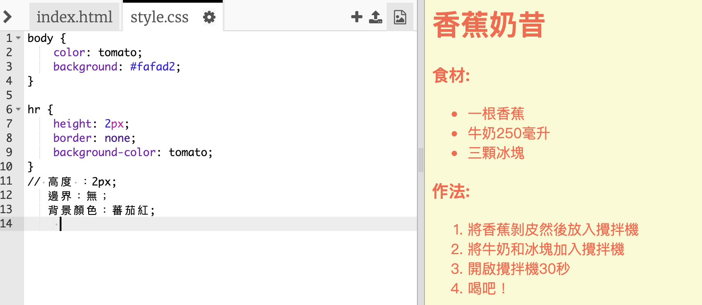
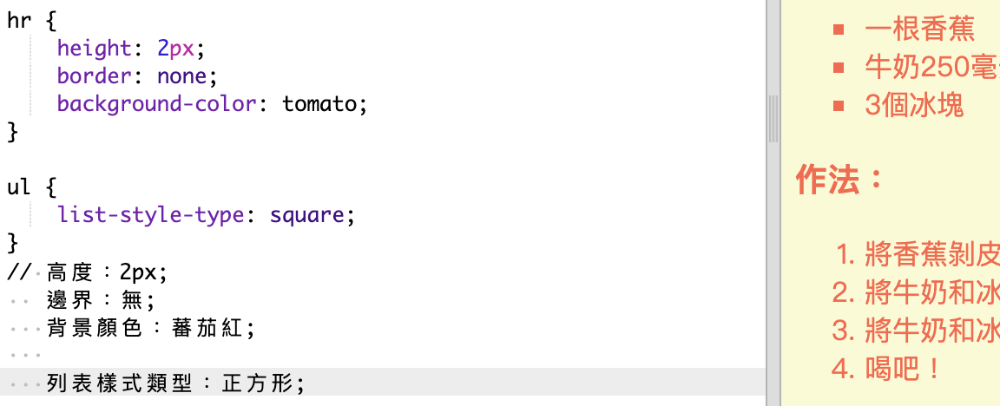

## 最後一步

讓我們再添加一些 HTML 和 CSS 來改善你的網頁。

+ 你可以使用 `
`標籤在你食譜的結尾添加一條水平線。

請注意，這個標籤沒有結束標記，就像是 `` 標籤一樣。

+ 你剛剛添加的線條與你網頁中其餘的樣式不相配。 讓我們透過添加一些CSS代碼來解決這個問題：

    hr {
        height: 2px;
        border: none;
        background-color: tomato;
    }
    

+ 你甚至可以透過個CSS代碼來改變項目符號的樣式：

    ul {
        list-style-type: square;
    }
    

